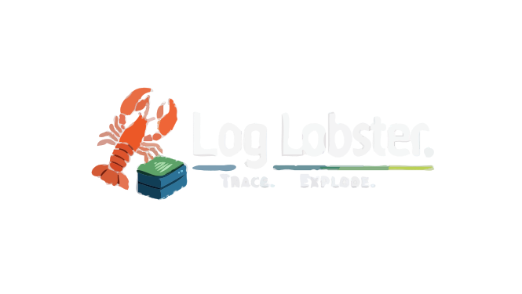
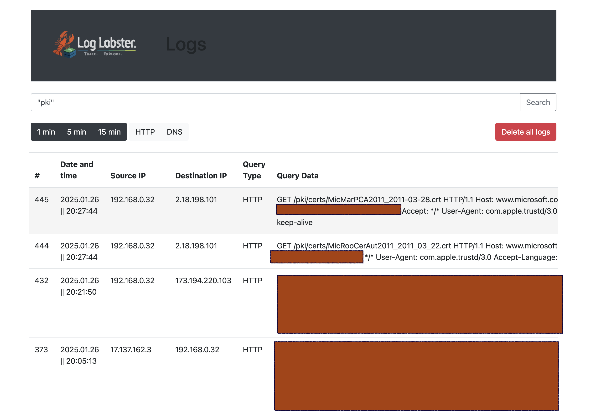

# 🦞 LogLobster!

**Pinch Vulnerabilities Before They Pinch You!**  
*A modern trap server for hunting SSRF, Log4j, and similar etc...*

 <!-- Will replace it later -->

---

## 🌟 About

**Log Lobster** is your vigilant crustacean guardian against server-side vulnerabilities! This dual-language (Python/Go) trap server for listening a remote responses from vulnerabilities like:

- 🕳️ SSRF (Server-Side Request Forgery)
- 🪵 Log4j (CVE-2021-44228)


Perfect for red teams, blue teams, and security researchers

*Project is under active development - expect exciting new features!*

---

## 🚀 Key Features

- 🐍 Hybrid Python/Go implementation
- 🔧 Custom search
- 📁 Log aggregation
- 🐳 Docker-ready deployment (soon!)

---

## 🛠️ Installation

### Prerequisites
- Python 3.10+
- Go 1.18+


```bash
# Clone repository
git clone https://github.com/0x4380/LogLobster.git
cd LogLobster

# Install Python dependencies
pip install -r requirements.txt

# Build Go components 
Coming soon!
